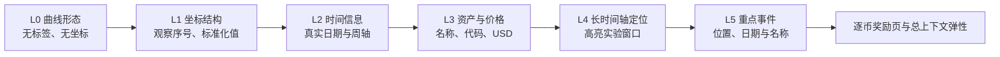

# 同曲异境：人类与 Agent 的市场阶段“上下文弹性”

版本：`context-elasticity-four-asset-v3`
状态：前期实验框架与交互原型  
数据基线日期：2026-08-11

## 1. 核心研究问题

对完全相同的金融价格曲线，人类和多模态 LLM/Agent 首先只根据视觉形态将其固定划分为三个阶段；随后逐层披露坐标、资产身份、真实日期、真实价格和历史事件，要求同一判断主体保留或修改两个阶段边界。

研究的主要因变量不是“最终谁更正确”，而是每一层新增语义使边界移动了多少、向什么方向移动，以及这种更新在人类与 Agent 之间是否系统不同。

建议的论文贡献表述：

> 本研究提出阶段边界的上下文弹性（context elasticity），用以量化同一判断主体在几何证据不变、语义信息逐层累积时对时间序列分段的修正，并比较人类与多模态智能体的更新方向、幅度、稳定性和信心变化。

## 2. 数据集审计与选择

`Li Blockchain` 项目的本机权威数据位于：

`E:\Blockchain Matlab\code_LZ2022_transfer_20260810\code_LZ2022`

已核验的数据层级如下：

| 数据层 | 数量 | 用途 |
|---|---:|---|
| 原始/补齐后的 CMC 日频 TSV | 1000 | 可重建曲线与精确日期、价格 |
| 当前清洗规则有效序列 | 993 | 后续扩展与稳健性分析 |
| 论文冻结周频 cohort | 678 | 正式实验母库与可复现基准 |

因此项目应使用 **678 条冻结序列**，不是 682 条。冻结 cohort 已与 MATLAB 数据逐项核验，周频长度为 35–807；Bitcoin 位于冻结 cohort 中，长度为 807 周。

正式研究不应让每名参与者判断全部 678 条曲线。建议：

1. 从 678 条母库中按序列长度、波动率、最大回撤、趋势强度和阶段清晰度分层抽取 24–40 条刺激；
2. 每名人类只判断 8–12 条，以平衡疲劳和统计功效；
3. 使用 balanced incomplete block design，使每条曲线获得近似相同的人类判断数；
4. Bitcoin 作为主要解释案例，其他加密资产用于检验结论是否只是 Bitcoin 历史知识造成；
5. 加入形状匹配的合成序列和标签互换条件，以识别模型记忆与人类先验。

当前 v3 原型使用 Bitcoin、Ethereum、Solana 和 BNB 四条代表性曲线，并统一截取 2020 年 8 月至 2024 年 12 月的共同窗口。每条曲线包含 229–230 个周度点，严格复现 Li 项目的“连续 7 个日频 Open 均值”聚合方式。四条曲线分别在显示窗口内做 min–max 标准化，从而让匿名阶段的纵向可视范围可比；披露真实价格时只更换纵轴和悬停读数，不改变曲线几何形状。另为每个币种生成一条更长的定位序列：BTC、ETH、BNB 覆盖 2018–2026，SOL 从其真实可用起点覆盖至 2026；定位序列不补造资产上线前的数据。原型中的事件标签只是可追溯的界面验证材料，不应直接作为正式预注册事件清单。

## 3. 实验任务分解

### 3.1 主实验：自由生成边界

- 固定阶段数 `K = 3`；
- 参与者选择两个有序边界 `b1 < b2`；
- 每轮信息披露后，可保留或移动已有边界；
- 同时提交 1–5 级信心和一段简短、可公开编码的理由；
- 不要求模型暴露隐藏思维链，只记录简短可观察解释。

### 3.2 独立实验：评价预设边界

向另一批被试展示预先标出的切点，要求评价合理性、移动方向和信心。该任务测量的是边界接受与锚定，不能和自由生成边界混在同一实验中。

### 3.3 稳健性任务：自由选择阶段数

固定三阶段可能把不存在的结构强加给曲线。确认性实验中加入一个较小的 free-K 条件，允许选择 2–5 个阶段，用于检查主要结论是否依赖 `K = 3`。

## 4. 信息披露状态机



| 层级 | 可见信息 | 仍然隐藏的信息 |
|---|---|---|
| L0 | 完全相同的价格几何形状 | 坐标、资产、日期、价格、事件 |
| L1 | 周序号、标准化纵轴 | 真实时间、资产、货币单位、长时间轴位置、事件 |
| L2 | 真实日期范围和周度时间刻度 | 资产、价格单位、长时间轴位置、事件 |
| L3 | 资产名称、代码、USD 价格刻度与点位数值 | 长时间轴位置和事件 |
| L4 | 更长可用历史中的实验窗口位置 | 重点事件 |
| L5 | 六个重点事件的位置、日期和中性名称 | 无 |

主 `trajectory` 组依次经历 L0→L5，保留上一轮边界作为可修改起点。真实时间先于资产身份，资产身份与真实价格同时披露，顺序固定而不在被试内随机。L4 新增长时间轴定位图，用以测量局部走势在更广历史位置中的解释变化。v3 将事件位置与事件名称合并披露，因此当前主流程估计的是二者的联合效应；若正式研究仍需区分视觉锚定与事件语义，应在独立消融组中重新拆开。为了分离语义效应和承诺/记忆效应，确认性研究仍应设置 `snapshot` 组：每名参与者对一条曲线只看到一个披露层级。

## 5. 反事实与消融条件

正式实验至少需要以下三类控制：

1. **身份反事实**：同一曲线随机标注为 Bitcoin、黄金、科技股或合成资产；
2. **事件反事实**：真实事件、时间偏移事件、合理但虚构事件，以及无事件；
3. **信息消融**：完整累积披露与 leave-one-layer-out 条件比较。

事件文案第一阶段只写“某日发生某事件”，避免使用“导致上涨/引发暴跌”等因果措辞。带因果框架的文字可以作为独立实验因子。

## 6. 人类与 Agent 的可比条件

### 6.1 人类样本

- 记录加密资产经验：无经验、偶尔关注、主动交易/研究、专业相关；
- 不收集真实姓名、邮箱、钱包地址或交易金额；
- 先做 30–50 人 pilot，依据边界移动的实际方差进行功效分析，再确定确认性样本量；
- 正式分析中把专业程度作为调节变量，而不是事后拆组。

### 6.2 Agent 样本

主比较应使用至少 3–4 个多模态模型家族，并冻结：

- 模型完整版本与调用日期；
- system/user prompt；
- 温度、随机种子或采样配置；
- 输入图片哈希与视口尺寸；
- 是否累积上下文；
- 是否允许搜索、代码和数据工具。

公平的主条件要求人类和模型看到同一张渲染图片，Agent 不得额外获得 CSV。另设“图片 + 结构化数据”和“可使用工具的 Agent”作为扩展条件。

对每个模型的多次调用是同一系统的重复测量，不能当作多个独立人类。分析需将模型家族/版本作为系统层级，调用作为嵌套重复。

### 6.3 防止历史记忆污染

- 使用精确日期条件与匿名日期条件对照；
- 对价格做正比例缩放或时间平移，保持几何结构不变；
- 加入真实曲线的标签互换版本；
- 优先加入模型训练截止日期之后的数据；
- 主实验关闭浏览和外部工具。

## 7. 前端实验流程

1. 简短研究说明、匿名同意和经验分层；
2. 练习曲线，确认参与者理解“两个边界 = 三个阶段”；
3. 四条曲线按会话随机排序；每条曲线内部固定按 L0→L5 展示；
4. L0 首次点击或拖动产生两个边界；
5. 每层提交边界、信心、主观影响、判断依据、理由和耗时；
6. 每次披露先出现独立确认卡；确认后才开始记录本轮作答时间；
7. 提交后不可回到上一层；
8. L1–L5 自动继承上一层边界，参与者可以保持不动；
9. 每完成一条曲线出现回答可视化奖励页，四条曲线共形成 24 次判断；
10. 完成后显示跨币种披露效应矩阵和单币种边界轨迹，但不提示所谓“正确答案”；
11. 服务器按轮次原子保存，页面刷新不应覆盖已经提交的决定；
12. 正式部署前增加退出研究和数据删除机制，并通过所在机构伦理审查。

## 8. 数据记录模型

### session

- `session_id`：随机 UUID；
- `actor_type`：human / agent；
- `participant_code`：可选匿名代码；
- `expertise`：经验分层；
- `experimental_arm`：trajectory / snapshot / counterfactual；
- `protocol_version`、`model_name`、`started_at`、`completed_at`。

### decision

- `session_id`、`curve_id`、`disclosure_level`；
- `boundary_1_index`、`boundary_2_index`；
- `boundary_1_ratio`、`boundary_2_ratio`；
- 提交时对应日期；
- `confidence`、`influence_rating`、`cue_tags`、`rationale`；
- `reveal_read_ms`、`first_move_ms`、`adjustment_count`、`elapsed_ms`；
- 唯一约束：同一 session、curve、layer 只能有一条正式提交。

## 9. 主要指标

对长度为 `T` 的曲线，披露层 `l` 的两个有序边界为 `S_l=(b_{1l}, b_{2l})`。

### 9.1 上下文弹性

```text
CE_l = (|b_1l - b_1,l-1| + |b_2l - b_2,l-1|) / (2T)
```

`CE_l=0` 表示该层新增信息没有改变边界；数值越大表示该信息层造成的修正越大。

### 9.2 有方向的边界更新

分别报告两个边界的：

```text
SignedShift_kl = (b_kl - b_k,l-1) / T
```

正值表示向曲线后部移动，负值表示向前部移动。不能只报告绝对距离，否则会丢失语义信息把切点推向哪个历史时期。

### 9.3 事件吸引效应

对事件日期 `e`：

```text
EA = distance(S_before, e) - distance(S_after, e)
```

正值表示事件披露后最近边界向事件靠近。真实事件与 sham event 的差异用于判断事件是否只是视觉锚点。

### 9.4 其他指标

- segmentation covering / Variation of Information；
- 容差窗口 boundary F1；
- 人内、模型内和组内一致性；
- 信心变化和信心—一致性校准；
- 理由编码：形态、趋势、波动率、极值、身份先验、日期记忆、事件叙事。

## 10. 确认性统计分析

主要模型为层级混合效应模型：

```text
ContextElasticity ~ ActorGroup * DisclosureLayer
                  + Expertise
                  + ExperimentalArm
                  + (1 + DisclosureLayer | Participant/System)
                  + (1 + ActorGroup | Curve)
```

同时报告：

- 人类与各模型家族的分层估计，不只汇总成一个“AI”；
- bootstrap 置信区间和按曲线置换检验；
- 多重比较校正；
- trajectory 与 snapshot 的差异；
- 真实事件与 sham event 的差异；
- linear/log 显示尺度的稳健性。

## 11. 预注册的核心假设

- **H1a**：长时间轴定位层 L4 会引起超出资产与价格层 L3 的边界修正；
- **H1b**：重点事件层 L5 会引起超出长时间轴定位层 L4 的边界修正，但 v3 主流程中的估计是事件位置与语义的联合效应；
- **H2**：人类与 Agent 的 `ActorGroup × DisclosureLayer` 交互显著，即两组并非只在总体敏感度上不同，而是对不同语义层反应不同；
- **H3**：真实事件和 sham event 都可能产生视觉锚定，但真实事件的吸引效应更强；
- **H4**：加密资产经验调节身份和日期层的边界修正；
- **H5**：知道身份和历史后，信心的增幅可能大于跨判断者一致性的增幅，形成“叙事性过度自信”。

关于“Agent 比人类更敏感还是更保守”不宜提前设单向假设；现有相关研究对上下文敏感性和更新保守性给出了相反线索，应使用双侧检验。

## 12. 项目阶段与交付物

### Phase 0：当前 v3 原型

- Bitcoin、Ethereum、Solana、BNB 四条曲线；
- 统一 2020–2024 实验窗口，L0–L5 累积披露；
- 2018–2026 可用长时间轴定位图；
- L5 联合披露重点事件的位置、日期和名称；
- 两个可拖动边界；
- 24 次逐步判断与扩展行为记录；
- 每币完成后的个人回答可视化奖励页；
- 完成页比较跨币种信息效应和个人边界轨迹；
- v1 原型保留在 `/legacy`。

### Phase 1：pilot

- 4–6 条真实曲线 + 2 条合成曲线；
- 30–50 名人类；
- 3 个多模态模型；
- 检查交互理解、疲劳、边界方差和事件文案。

### Phase 2：预注册确认性研究

- 24–40 条分层刺激；
- trajectory + snapshot + counterfactual；
- 基于 pilot 的功效样本量；
- 冻结代码、刺激哈希、模型提示和分析脚本。

### Phase 3：论文与开放材料

- 匿名化决策数据；
- 刺激生成脚本；
- 人类界面与 Agent runner；
- 预注册和分析 notebook；
- 事件筛选与 sham 构造审计表。
